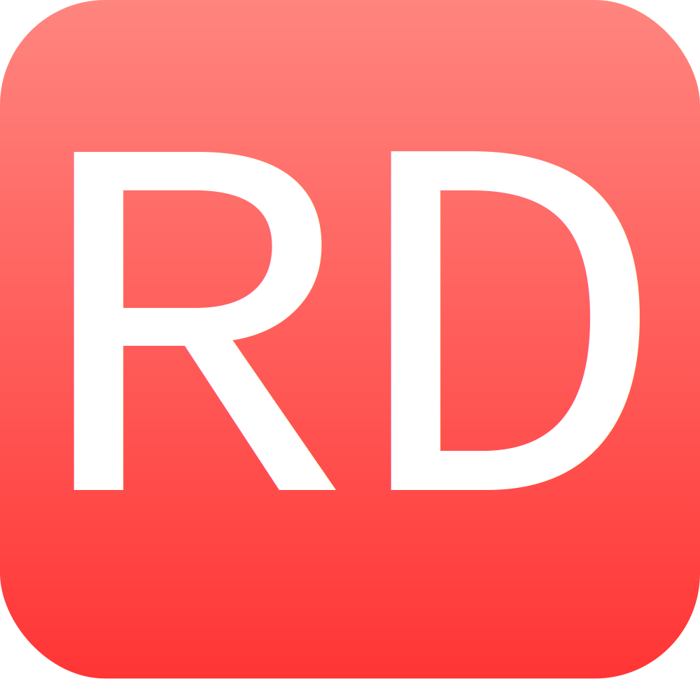

<!-- PROJECT SHIELDS -->
[![Contributors][contributors-shield]][contributors-url]
[![Stargazers][stars-shield]][stars-url]
[![Issues][issues-shield]][issues-url]

<!-- PROJECT LOGO -->
 

  

<h3 align="center">RedDictio</h3>

  

    Utilizing machine learning, to analyze subreddit comments for hate/toxicity.
     
    <a href="https://github.com/rpsmith77/RedDictio"><strong>Explore the docs »</strong></a>
     
     
    <a href="https://github.com/rpsmith77/RedDictio/issues">Report Bug</a>
    ·
    <a href="https://github.com/rpsmith77/RedDictio/issues">Request Feature</a>
  

<!-- TABLE OF CONTENTS -->

  
Table of Contents

  <ol>
    <li>
      <a href="#about-the-project">About The Project</a>
      <ul>
        <li><a href="#built-with">Built With</a></li>
      </ul>
    </li>
    <li><a href="#contributing">Contributing</a></li>
    <li><a href="#contact">Contact</a></li>
    <li><a href="#acknowledgments">Acknowledgments</a></li>
  </ol>

<!-- ABOUT THE PROJECT -->

## About The Project

RedDictio is overall a test of our ability to create a webpage, hook it up to a hosted database, scrape data from
reddit, and judge this data using a neural network. It connects to several fields in computing such as Database Design,
Data Engineering, Data Science, Machine Learning, Cloud Computing, and Web Development.

## Issues and Solutions
- Data for the Neural Network was one of the biggest issues. Determining what is hateful language is very serious, therefore it is important to have the highest accuracy possible when detecting hate. We tested two different data sets. The first one was from reddit but could only get roughly 75% accuracy on its own validation set. The second dataset was generated by another neural network, but it could only reach an 80% accuracy on it’s validation set. An attempt was made at combining the two to see if it would reach a higher accuracy, but it did not. Finally, a Twitter dataset was used which reached an amazing 95% accuracy. While this was by no means perfect and a higher accuracy should be aimed for, it was a great choice for the project given the time constraints.
- We considered hosting it online on Google Vertex AI or on a Virtual Machine. These were both great choices, but we were not able to get either of them to work well for a cheap enough price. Vertex AI would have ended up costing us over $100 a month while a Virtual Machine would have cost a few dollars a day. Since we desired for the project to be permanently hosted, not just for this semester, we sought another solution. We ended up deciding to host the Neural Network on Google Drive. This is most certainly not the best solution but it is the cheapest and most effective or the price.
- We had the option of handling all of the processing on the Cloud, but because of our inexperience, and the cost of using the Google Cloud, we ended up hosting it on Google Colab. Google Colab is a cloud service provided by Google. It costs roughly $10 a month for the first premium service, which is significantly cheaper than the other options Google Cloud offered. The only issue is that it has to be manually run and monitored, but it still uses Google GPUs and storage instead of our own computers.
- We tried using Google Query but it would not work with our data and had very confusing tutorials to set up. We then tried using Cloud SQL, but it was far too expensive for a service. As a result, we went for the safer option of using Sqlite3 and hosting the DB directly on the webpage. This was not a good choice, this would slow the server and would make it incredibly hard to edit the DB, but we wanted an option that functioned. Luckily, we discovered Amazon RDS and migrated all the data and code to MySql. Now all the processing connects to the RDS DB and updates it remotely, while the web page accesses the same DB remotely. We can therefore update the DB dynamically and change the data whenever we want, all for completely free.
- At first we were hosting the webpage through Google App Engine, however, we were being ~$10/day, which is out of the picture for broke college students. Google Cloud has many products that are named similarly so it was confusing to figure out which one to use. After researching the cost of each option, we decided to switch to Google Cloud Run and have only been charged a few cents since then.
- Since we are remotely accessing our database and auto deploying to Google Cloud Run, it would be a terrible idea to make those credentials public. To obfuscate the credentials, we used Github Secrets and Environment Variables. Github Secrets is a built-in tool in Github that allows the user to add credentials and other ‘secrets’, and allows them to be used in workflows. This is what enables the auto deployment to Google Cloud Run.  The Environment Variable had to be configured within the Google Cloud Run API to enter the credentials needed to access the remote database.

## Future Goals

- Rework the neural network
- Limit amount of comments being displayed on one page
- Add more neural networks
- Allow users to vote on whether a comment is hateful or not

(<a href="#top">back to top</a>)

### Built With

#### Neural Network

* [Python](https://www.python.org/)
* [Google Colab](https://colab.research.google.com/)
* [Keras](https://keras.io/api/)
* [Pandas](https://pandas.pydata.org/docs/)
* [PRAW](https://praw.readthedocs.io/en/stable/)

#### Web Page

* [Python](https://www.python.org/)
* [Flask](https://flask.palletsprojects.com/en/2.0.x/)
* [Github](https://github.com/)
* [Google Cloud Run](https://cloud.google.com/run/docs)
* [Flask-SQLAlchemy](https://flask-sqlalchemy.palletsprojects.com/en/2.x/)
* [Docker](https://docs.docker.com/)
* [Chart.js](https://www.chartjs.org/docs/latest/)
* [Gunicorn](https://gunicorn.org/)

(<a href="#top">back to top</a>)

<!-- CONTRIBUTING -->

## Contributing

At this time we aren't looking for any contributors. If you feel like you have an idea that would benefit this project,
please feel free to contact either Jairo or Ryan.

(<a href="#top">back to top</a>)

<!-- CONTACT -->

## Contact

Jairo Garciga - [Linkedin](https://www.linkedin.com/in/jairo-garciga/) | [Github](https://github.com/Jgar157)  
Ryan Smith - [Linkedin](https://www.linkedin.com/in/ryan--smith/) | [Github](https://github.com/rpsmith77/)

Project Link: [https://github.com/rpsmith77/RedDictio](https://github.com/rpsmith77/RedDictio)

(<a href="#top">back to top</a>)

<!-- ACKNOWLEDGMENTS -->

## Acknowledgments

Thank you to everyone who helped with this. Special shout out to:

* Professor Greenwell
* [This "Deploy To Google Cloud Run Using Github Actions" tutorial](https://towardsdatascience.com/deploy-to-google-cloud-run-using-github-actions-590ecf957af0)
* Caffeine
* [Viewers Like You](https://www.youtube.com/watch?v=EVwOHHFr9_E)

(<a href="#top">back to top</a>)

<!-- MARKDOWN LINKS & IMAGES -->
<!-- https://www.markdownguide.org/basic-syntax/#reference-style-links -->

[contributors-shield]: https://img.shields.io/github/contributors/rpsmith77/RedDictio.svg?style=for-the-badge

[contributors-url]: https://github.com/rpsmith77/RedDictio/graphs/contributors

[stars-shield]: https://img.shields.io/github/stars/rpsmith77/RedDictio.svg?style=for-the-badge

[stars-url]: https://github.com/rpsmith77/RedDictio/stargazers

[issues-shield]: https://img.shields.io/github/issues/rpsmith77/RedDictio.svg?style=for-the-badge

[issues-url]: https://github.com/rpsmith77/RedDictio/issues
